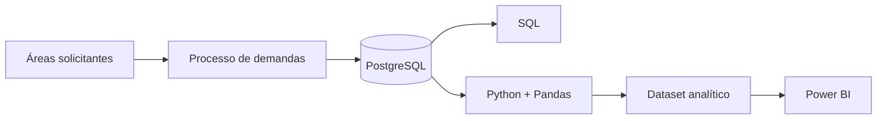
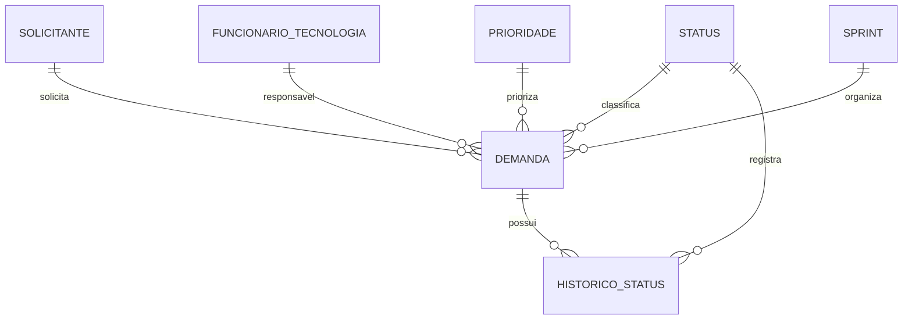
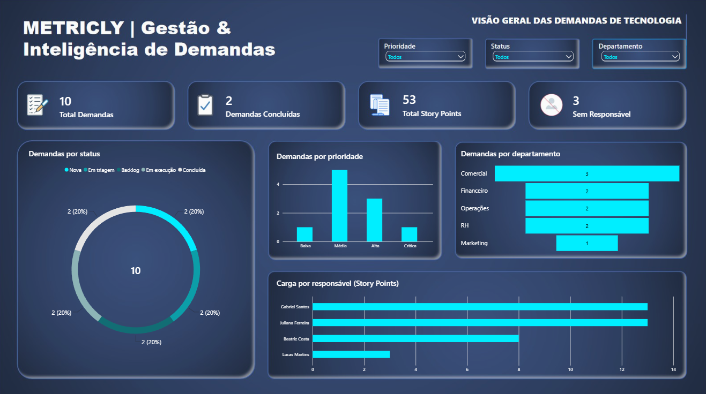

# Metricly | Gestão & Inteligência de Demandas

O **Metricly** é um projeto de portfólio que simula a análise e estruturação de uma solução para gestão de demandas de Tecnologia em uma empresa fictícia.

O projeto parte de um problema de negócio — solicitações descentralizadas, ausência de critérios padronizados de priorização e baixa visibilidade sobre as demandas — e percorre etapas de análise de processos, levantamento de requisitos, modelagem de dados, SQL, análise com Python e construção de indicadores no Power BI.

> Todos os dados e organizações apresentados neste projeto são fictícios e foram criados exclusivamente para fins educacionais e de portfólio.

---

## Problema de negócio

Na empresa fictícia **NexaFlow**, as demandas destinadas à área de Tecnologia eram recebidas por diferentes canais, como e-mail, Teams e contato direto.

Parte das solicitações era registrada em planilhas, mas não existia um processo único e padronizado.

Isso gerava problemas como:

- ausência de uma fonte centralizada de demandas;
- dificuldade para acompanhar status e responsáveis;
- priorização sem critérios padronizados;
- baixa visibilidade sobre a carga da equipe;
- registros incompletos ou desatualizados;
- dificuldade para gerar indicadores confiáveis.

---

## Solução proposta

O Metricly foi estruturado como uma proposta de melhoria para esse processo, contemplando:

- registro padronizado de demandas;
- definição de status e prioridades;
- associação de solicitantes e responsáveis;
- organização de demandas em backlog e sprint;
- histórico de mudanças de status;
- análise da carga de trabalho;
- geração de indicadores para acompanhamento gerencial.

O escopo deste repositório concentra-se na **análise de negócio, modelagem da solução, banco de dados, análise de dados e dashboard**, e não na implementação de uma aplicação completa de interface.

---

## Processo analisado

### AS-IS

Fluxo identificado no cenário inicial:

`Necessidade → E-mail/Teams/Contato direto → Distribuição informal → Priorização informal → Acompanhamento descentralizado → Conclusão`

### TO-BE

Fluxo proposto:

`Necessidade → Registro padronizado → Triagem → Priorização → Backlog → Atribuição → Execução → Acompanhamento → Validação → Conclusão`

A documentação completa da análise está disponível na pasta [`docs`](docs/).

---

## Arquitetura do projeto



O PostgreSQL concentra os dados relacionais da solução. O Python consulta o banco, realiza a preparação dos dados e exporta o dataset utilizado pelo Power BI.

---

## Modelo de dados

O banco foi estruturado com as seguintes entidades principais:



Essa estrutura permite analisar a demanda considerando solicitante, departamento, responsável, status, prioridade, sprint e histórico de movimentações.

---

## Dashboard

O dashboard foi desenvolvido no **Power BI** para apresentar uma visão gerencial das demandas de Tecnologia.

Principais indicadores:

- Total de demandas;
- Demandas concluídas;
- Total de Story Points;
- Demandas sem responsável;
- Distribuição por status;
- Distribuição por prioridade;
- Distribuição por departamento;
- Carga de trabalho por responsável.

### Visão geral



---

## Tecnologias utilizadas

- **PostgreSQL** — banco de dados relacional;
- **SQL** — modelagem, consultas, joins, agregações e indicadores;
- **Python** — integração e preparação dos dados;
- **Pandas** — manipulação e análise do dataset;
- **SQLAlchemy** — conexão entre Python e PostgreSQL;
- **Power BI** — dashboard e indicadores;
- **DAX** — criação de medidas;
- **Git/GitHub** — versionamento e publicação;
- **Scrum** — organização do MVP, backlog, Sprint Goal e Definition of Done.

---

## Indicadores do dataset de demonstração

Na versão atual do conjunto de dados:

| Indicador | Resultado |
|---|---:|
| Total de demandas | 10 |
| Demandas concluídas | 2 |
| Total de Story Points | 53 |
| Demandas sem responsável | 3 |

Os dados foram criados para simular diferentes cenários do ciclo de vida das demandas.

---

## Estrutura do repositório

```text
metricly/
│
├── data/
│   └── metricly_dataset.csv
│
├── database/
│   ├── schema.sql
│   ├── seed.sql
│   └── queries.sql
│
├── docs/
│   ├── business_case.md
│   ├── as_is.md
│   ├── gap_analysis.md
│   ├── to_be.md
│   ├── requirements.md
│   ├── user_stories.md
│   └── scrum.md
│
├── powerbi/
│   └── metricly_dashboard.pbix
│
├── python/
│   └── data_analysis.py
│
├── .env.example
├── .gitignore
└── README.md
```

---

## Como executar o projeto

### 1. Banco de dados

Crie um banco PostgreSQL chamado:

```text
flowmetrics
```

Execute primeiro:

```text
database/schema.sql
```

Depois:

```text
database/seed.sql
```

### 2. Dependências Python

Instale:

```bash
python -m pip install pandas sqlalchemy psycopg2-binary python-dotenv
```

### 3. Variáveis de ambiente

Use o arquivo `.env.example` como referência e crie localmente um arquivo `.env`:

```env
DB_USER=postgres
DB_PASSWORD=sua_senha
DB_HOST=localhost
DB_PORT=5432
DB_NAME=flowmetrics
```

O arquivo `.env` está ignorado pelo Git e não deve ser publicado.

### 4. Gerar o dataset

Na raiz do projeto:

```bash
python python/data_analysis.py
```

O script consulta o PostgreSQL e gera:

```text
data/metricly_dataset.csv
```

### 5. Power BI

Abra:

```text
powerbi/metricly_dashboard.pbix
```

e atualize os dados.

---

## Competências demonstradas

Este projeto foi desenvolvido para demonstrar competências relacionadas a:

- análise de processos AS-IS e TO-BE;
- identificação de problemas e causa raiz;
- levantamento e documentação de requisitos;
- regras de negócio e requisitos funcionais;
- User Stories e critérios de aceitação;
- organização de backlog e Sprint;
- modelagem de banco de dados relacional;
- SQL e análise de dados;
- integração PostgreSQL + Python;
- preparação de dados com Pandas;
- construção de KPIs;
- desenvolvimento de dashboard no Power BI;
- documentação técnica e de negócio.

---

## Contexto

Projeto desenvolvido como parte de um portfólio de **Análise de Sistemas, Processos e Dados**, integrando conhecimentos de negócio e tecnologia em um único case.